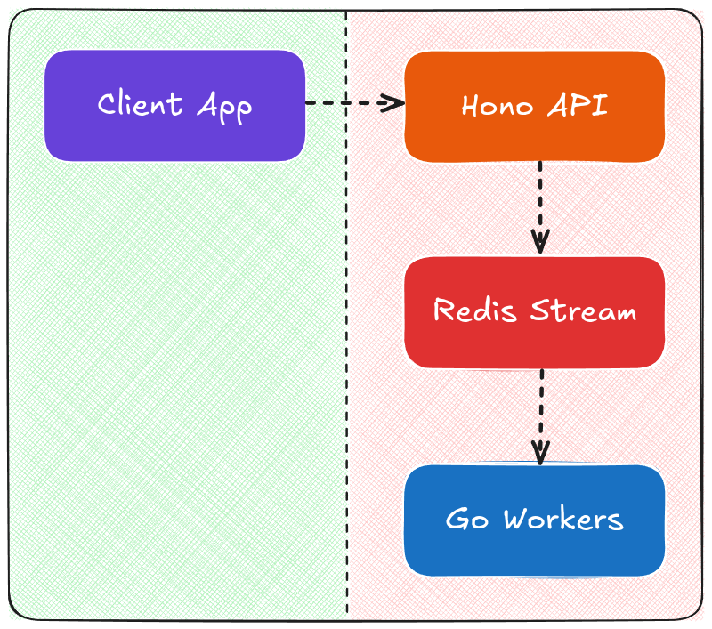

# Redis Stream Processor

A distributed message processing system using Redis Streams with a Go consumer backend and Node.js API for job submission and status tracking. This project demonstrates concurrent processing with Go routines and can be used as a foundation for building scalable, asynchronous task processing systems.

## 🌟 Features

- **Concurrent Processing**: Leverages Go's powerful concurrency model with goroutines
- **Redis Streams**: Uses Redis Streams for reliable message queue functionality
- **Consumer Groups**: Implements consumer groups for guaranteed message delivery
- **Status Tracking**: Provides real-time status updates on message processing
- **API Interface**: Hono.js API for message submission and status polling
- **Docker Support**: Easy deployment with Docker Compose

## 🏗️ Architecture


## 🚀 Getting Started

### Prerequisites

- Go 1.19 or higher
- Node.js 16.x or higher
- pnpm
- Redis 6.x or higher
- Docker & Docker Compose (optional for running redis locally)

### Installation

1. Clone the repository:
   ```bash
   git clone https://github.com/soham901/go-redis-stream-worker.git
   cd go-redis-stream-worker
   ```

2. Start Redis (if not using Docker):
   ```bash
   redis-server
   # Or use docker compose
   make docker-up
   ```

3. Build and run the application:
   ```bash
   # Run everything
   make run
   
   # Or run services individually
   make run-worker   # Start Go workers
   make run-api      # Start Hono API
   ```

## 📝 API Documentation

### Produce a Message

```http
POST /produce
Content-Type: application/json

{
  "message": "Your message content"
}
```

Response:
```json
{
  "success": true,
  "messageId": "1741013205952-0",
  "id": "1741013205952"
}
```

### Check Message Status

```http
GET /status/:id
```

Response:
```json
{
	"status": "completed",
	"result": "Processed result for message Your message content",
	"timestamp": 1741013205952,
	"completedAt": 1741013207958
}
```

## 🛠️ Development

### Project Structure

```
go-redis-stream-worker/
├── api/                # Hono.js API server
├── backend/            # Go worker implementation
├── deployments/        # Docker and deployment configurations
├── Makefile            # Build and run scripts
└── README.md           # Project documentation
```

### Make Commands

| Command | Description |
|---------|-------------|
| `make run` | Start both API and worker services |
| `make run-api` | Start only the Hono API server |
| `make run-worker` | Start only the Go worker service |
| `make build` | Build both API and worker |
| `make build-api` | Build only the API |
| `make build-worker` | Build only the worker |
| `make docker-up` | Start all services with Docker Compose |
| `make docker-down` | Stop all Docker Compose services |

## ⚙️ Configuration

Configuration is handled through environment variables:

```env
# Redis connection
REDIS_HOST=localhost
REDIS_PORT=6379

# API server
API_PORT=3000

# Worker configuration
WORKER_COUNT=5
STREAM_NAME=mystream
GROUP_NAME=mygroup
```

## 🔍 Use Cases

- Background task processing
- Event-driven architectures
- Distributed workloads
- Microservice communication
- Job queue systems

## 📚 Learning Resources

This project demonstrates several important Go concepts:

- Goroutines for concurrent processing
- Channels for communication between goroutines
- Redis Streams for reliable message queuing
- Consumer groups for distributed processing

## 🤝 Contributing

Contributions are welcome! Please feel free to submit a Pull Request.

## 📄 License

This project is licensed under the MIT License - see the LICENSE file for details.